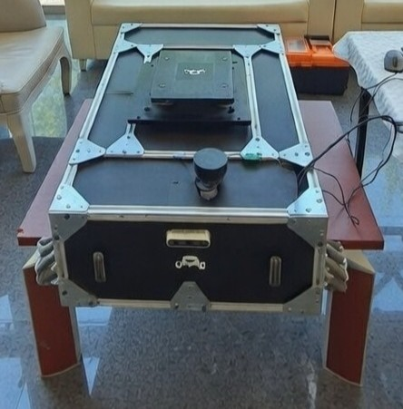

# Mecanum AMR — Autonomous Mobile Robot

[](https://github.com/Trkkhrmn/ros2_amr_mecanumbot/actions/workflows/ci.yml)
[](https://docs.ros.org/en/humble/)
[](https://gazebosim.org/)
[](LICENSE)

ROS 2 Humble + Gazebo simulation of a **mecanum-wheel** autonomous warehouse robot — LiDAR scanning, SLAM mapping, QR-based goal setting, Nav2 navigation, and a pick-and-place lift.

---

## About this project

This repository contains the **simulation** and **hardware layer** of a Mecanum AMR built as a team project at **Yıldız Technical University, Faculty of Electrical and Electronics**.

The physical robot used a **Jetson Nano** (ROS 2, Nav2, SLAM, QR goal parsing, task state machine) and an **STM32** (four mecanum motors + lift actuator, driven over UART). The full autonomous stack was developed and validated in Gazebo; on the real robot we ran manual teleoperation and lift control for demos. After the team disbanded, this repo was created to preserve and share the work.

What you get here:

- **Working Gazebo simulation** — full autonomy stack (SLAM, Nav2, QR goals, lift, state machine) runs end-to-end.
- **Hardware integration layer** — the Jetson ↔ STM32 UART protocol, the ROS 2 bridge node, and STM32-side protocol parser with motor/lift stubs. Designed for real deployment, not just sim.

---

## Table of contents

- [Package layout](#-package-layout)
- [Hardware integration (real robot)](#-hardware-integration-real-robot)
- [Requirements](#-requirements)
- [Installation](#-installation)
- [Usage](#-usage)
- [Architecture](#-architecture)
- [Topics](#-topics)
- [Project team](#-project-team)
- [License](#-license)

---

## Package layout

| Package | Description |
|---------|-------------|
| `mecanum_description` | URDF/Xacro robot model (LiDAR, camera, lift) |
| `mecanum_bringup` | Launch files to bring up the full stack |
| `mecanum_navigation` | SLAM Toolbox + Nav2 config and maps |
| `mecanum_control` | Lift control and mecanum kinematics (C++ node + Python scripts) |
| `mecanum_task_manager` | QR reading, task planning, state machine |
| `mecanum_simulation` | Gazebo warehouse world and robot spawn setup |
| `mecanum_hw_bridge` | Jetson ↔ STM32 UART bridge (cmd\_vel + lift commands) |

---

## Hardware integration (real robot)

### Stack overview

| Component | Role |
|-----------|------|
| **Jetson Nano** | Runs ROS 2 Humble: Nav2, SLAM, QR parser, task manager, mecanum kinematics. Publishes `/cmd_vel` and lift commands. Communicates with STM32 over UART. |
| **STM32** | Receives motion and lift commands via UART. Drives 4× mecanum motors (PWM) and lift actuator. Watchdog halts motors if no command is received within ~300–500 ms. |

```
  Jetson Nano (ROS 2)
  /cmd_vel, /lift/up|down
        │
  mecanum_hw_bridge
        │
   UART 115200 baud
        │
  STM32 ── parse protocol ── PWM: 4× wheels + lift
```

### UART protocol (Jetson ↔ STM32)

ASCII, line-based, 115200 8N1. All frames are LF-terminated:

| Direction | Frame | Meaning |
|-----------|-------|---------|
| Jetson → STM32 | `M,w_fl,w_fr,w_rl,w_rr\n` | Wheel speeds in rad/s. Sent at 20–50 Hz. |
| Jetson → STM32 | `L,0\n` / `L,1\n` | Lift down / up. |
| Jetson → STM32 | `H\n` *(optional)* | Heartbeat. |
| STM32 → Jetson | `T,...\n` *(optional)* | Telemetry. |

Full protocol spec: [hardware/docs/PROTOCOL.md](hardware/docs/PROTOCOL.md)

### Hardware architecture

```
                ┌──────────────────────────────────────────────────┐
                │              Jetson Nano                          │
                │  Ubuntu 20.04, ROS 2 Humble                       │
                │  Nav2 · SLAM · QR · Task manager                 │
                │  mecanum_hw_bridge (UART ↔ ROS)                  │
                │  LiDAR · Camera                                   │
                └──────────────┬────────────────────────────────────┘
                               │  UART (TX/RX/GND) — 115200 baud
                               ▼
                ┌──────────────────────────────────────────────────┐
                │              STM32 (F4 / F7)                      │
                │  Parse motion + lift commands                     │
                │  PWM: 4× wheels + 1× lift                         │
                │  Watchdog: stop on timeout                        │
                └──────────────┬────────────────────────────────────┘
                               │
             ┌─────────────────┴─────────────────┐
             ▼                                   ▼
      ┌─────────────┐                     ┌─────────────┐
      │ 4× Mecanum  │                     │ Lift        │
      │ motor driver│                     │ actuator    │
      └─────────────┘                     └─────────────┘
```

**Connection summary:**

| From | To | Interface |
|------|----|-----------|
| Jetson TX | STM32 RX | UART (commands) |
| Jetson RX | STM32 TX | UART (optional telemetry) |
| GND | GND | Common ground |
| STM32 | 4× motors | PWM / motor driver |
| STM32 | Lift | GPIO / PWM |

> Use `/dev/ttyTHS1` (Jetson 40-pin) or `/dev/ttyUSB0` (USB–serial). Use a level shifter if your STM32 is 3.3V.

Pinout and timer channels are board-dependent — see [hardware/stm32/](hardware/stm32/) for protocol code and placeholders.

### Running on Jetson (real robot)

```bash
# 1. Add yourself to dialout (log out and back in after)
sudo usermod -aG dialout $USER

# 2. Install pyserial
pip3 install pyserial

# 3. Build and launch the bridge
colcon build --symlink-install
source install/setup.bash
ros2 launch mecanum_hw_bridge real_robot_bringup.launch.py serial_port:=/dev/ttyTHS1
```

Use `serial_port:=/dev/ttyUSB0` for USB–serial. The bridge sends zero-velocity frames when no `/cmd_vel` is received for 0.5 s, so the STM32 watchdog will not trigger spuriously.

Full deployment guide: [docs/DEPLOYMENT_JETSON.md](docs/DEPLOYMENT_JETSON.md)

### Quick start on your own mecanum robot

**STM32 side:** Drop the protocol code from `hardware/stm32/` into your project and implement `motor_set_speeds(w_fl, w_fr, w_rl, w_rr)` and `lift_set(0|1)` with your PWM/HAL. Configure UART at 115200 8N1 and add a watchdog (stop all motors if no frame for 500 ms).

**Jetson/PC side:** Clone the repo, run `rosdep install`, `colcon build`, then launch the bridge with the correct `serial_port`. Adjust `wheel_radius`, `lx`, and `ly` in the `mecanum_hw_bridge` config if your robot geometry differs.

**First test:** Publish a `/cmd_vel` message and call `/lift/up` / `/lift/down` to verify motion and lift before running the full autonomous stack.

Step-by-step wiring, flashing, and troubleshooting: [docs/REAL_ROBOT_QUICKSTART.md](docs/REAL_ROBOT_QUICKSTART.md) · [hardware/README.md](hardware/README.md)

**Real system photos:**

|  |  |
|:---:|:---:|
| Physical AMR (Jetson Nano, LiDAR, enclosure) | AMR picking up a load with the lift |


*Obstacle avoidance and path planning tests — Yıldız Technical University, Faculty of Electrical and Electronics.*

---

## Requirements

- **ROS 2 Humble** (Ubuntu 22.04 recommended)
- **Gazebo Classic 11**
- **Nav2**, **SLAM Toolbox**, **cv_bridge**

For lift actuation in Gazebo:

```bash
sudo apt install ros-humble-gazebo-ros2-control ros-humble-ros2-control \
  ros-humble-ros2-controllers ros-humble-ros2controlcli
```

---

## Installation

```bash
mkdir -p ~/ros2_ws/src
cd ~/ros2_ws/src
git clone https://github.com/Trkkhrmn/ros2_amr_mecanumbot.git .

cd ~/ros2_ws
rosdep install --from-paths src --ignore-src -r -y
colcon build --symlink-install
source install/setup.bash
```

### Docker

```bash
docker build -f docker/Dockerfile -t mecanum_amr .
docker run -it --rm \
  -e DISPLAY=$DISPLAY \
  -v /tmp/.X11-unix:/tmp/.X11-unix \
  mecanum_amr \
  ros2 launch mecanum_bringup sim_bringup.launch.py
```

---

## Usage

### Starting the simulation

```bash
# Warehouse world + robot + lift (default)
ros2 launch mecanum_bringup sim_bringup.launch.py

# With Nav2 + SLAM enabled
ros2 launch mecanum_bringup sim_bringup.launch.py launch_navigation:=true

# Minimal or empty world
ros2 launch mecanum_bringup sim_bringup.launch.py world:=minimal

# Robot model only (RViz)
ros2 launch mecanum_description display.launch.py

# Navigation only (SLAM mode)
ros2 launch mecanum_navigation navigation.launch.py slam_mode:=true
```

**Worlds:** Default is `warehouse` (shelves + QR stations). Alternatives: `world:=minimal`, `world:=empty`.

**Task manager (QR + Nav2):** Add `launch_task_manager:=true`. Requires `ros-humble-nav2-bringup` and `ros-humble-nav2-msgs`.


### Green lane following

The warehouse world has two green lines on the floor. A dedicated node detects them via the robot's camera and can drive the robot autonomously between them.


```bash
# Start simulation (if not running)
ros2 launch mecanum_bringup sim_bringup.launch.py

# Camera view + detection indicators only (no motion)
ros2 run mecanum_control green_lane_detector.py

# Follow the lines autonomously
ros2 run mecanum_control green_lane_detector.py --follow
```

The detector window shows **GREEN DETECTED**, **CENTERED**, or **OFFSET LEFT/RIGHT**, with a yellow line for strip center and blue for image center. Requires `cv_bridge` and OpenCV (`sudo apt install ros-humble-cv-bridge`). Source topic: `/camera/image_raw`. Full guide: [docs/GREEN_LANE.md](docs/GREEN_LANE.md)

### SLAM mapping

```bash
# Launch warehouse world + SLAM Toolbox + RViz
ros2 launch mecanum_navigation test_mapping_slam.launch.py world:=warehouse

# In a second terminal — drive the robot to build the map
ros2 run teleop_twist_keyboard teleop_twist_keyboard
# w/s: forward/back · a/d: turn

# Save the map when done
ros2 run nav2_map_server map_saver_cli \
  -f src/mecanum_navigation/maps/warehouse_map \
  --ros-args -p map_subscribe_transient_local:=true
```

Full guide: [docs/MAPPING_WAREHOUSE.md](docs/MAPPING_WAREHOUSE.md)

|  |  |
|:---:|:---:|
| QR-based navigation to a target pose | Occupancy grid built from LiDAR |

### Troubleshooting

| Issue | Fix |
|-------|-----|
| `Entity [mecanum_amr] already exists` | Close all Gazebo windows and re-run the launch. |
| `gzserver` exits with code 255 | Run `pkill -9 gzserver; pkill -9 gzclient`, then retry. For verbose output: `gzserver --verbose $(ros2 pkg prefix mecanum_simulation)/share/mecanum_simulation/worlds/warehouse.world`. For GPU issues, prepend `LIBGL_ALWAYS_SOFTWARE=1`. |

---

## Architecture


**Task state machine:**
`IDLE → READING_QR → NAVIGATING_TO_LOAD → ALIGNING → LIFTING → NAVIGATING_TO_DROP → LOWERING → RETURNING_HOME → IDLE`

---

## Topics

| Topic | Message type | Direction | Description |
|-------|-------------|-----------|-------------|
| `/scan` | `sensor_msgs/msg/LaserScan` | Published | LiDAR distance data |
| `/cmd_vel` | `geometry_msgs/msg/Twist` | Subscribed | Linear and angular velocity commands |
| `/odom` | `nav_msgs/msg/Odometry` | Published | Wheel odometry |
| `/map` | `nav_msgs/msg/OccupancyGrid` | Published | SLAM-generated occupancy map |
| `/qr/data` | `std_msgs/msg/String` | Published | Raw QR code payload |
| `/qr/goal_pose` | `geometry_msgs/msg/PoseStamped` | Published | Navigation goal parsed from QR |
| `/robot_state` | `std_msgs/msg/String` | Published | Current state machine state |
| `/lift/up` | `std_msgs/msg/Empty` | Subscribed | Trigger lift up |
| `/lift/down` | `std_msgs/msg/Empty` | Subscribed | Trigger lift down |
| `/camera/image_raw` | `sensor_msgs/msg/Image` | Published | Raw camera feed |

**QR payload format:** `x:<float>;y:<float>;yaw:<float>` — e.g. `x:3.5;y:1.2;yaw:1.57`

---

## Project team

| Role | Who | Contribution |
|------|-----|--------------|
| Simulation & integration | **Tarık Kahraman** | Gazebo world, bringup launch files, full-stack integration |
| Image processing & Jetson | **Muhammed Sait Karadeniz** | Camera pipeline, Jetson software setup, hardware integration |
| Motors & firmware | **Samet Hasan Köse** | STM32 firmware, motor control, motor driver hardware |

---

## License

[MIT License](LICENSE). Contributions are welcome — fork the repo, make your changes, and open a PR. CI runs on pushes to `main`/`develop` and on all PRs. For code style and test guidelines see [CONTRIBUTING.md](CONTRIBUTING.md).
