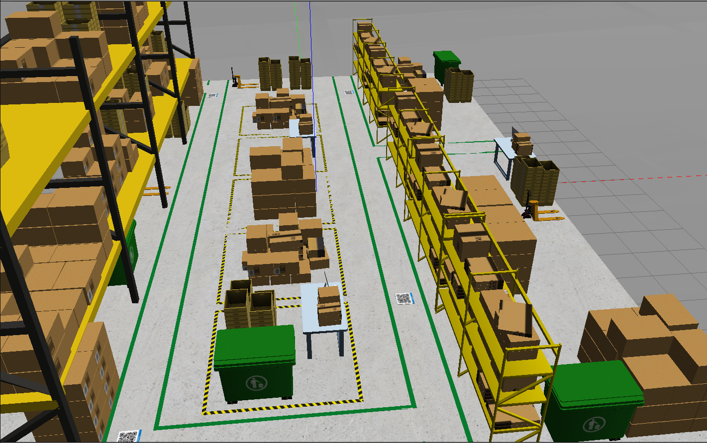
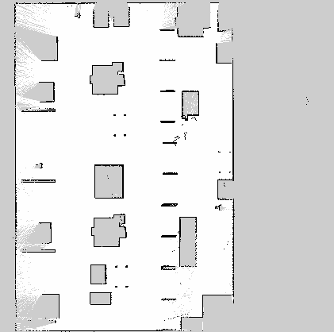
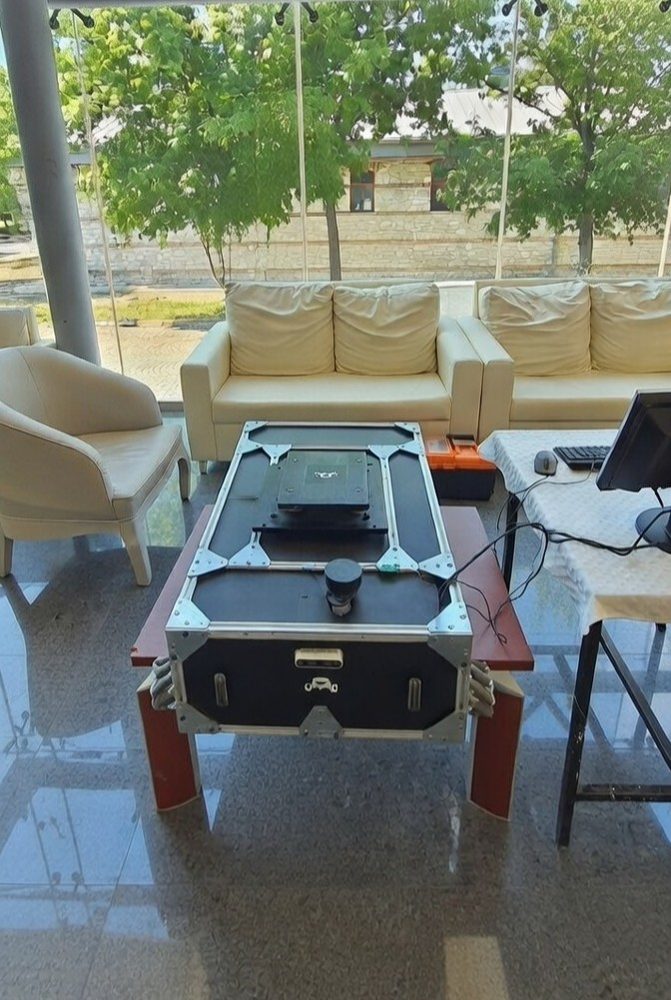

# Mecanum AMR — Autonomous Mobile Robot

[](https://github.com/Trkkhrmn/ros2_amr_mecanumbot/actions/workflows/ci.yml)
[](https://docs.ros.org/en/humble/)
[](https://gazebosim.org/)
[](LICENSE)

ROS 2 Humble + Gazebo simulation of a mecanum-wheel autonomous warehouse robot. It scans the environment with LiDAR, builds a map with SLAM, reads QR codes to get target poses, navigates there with Nav2, and uses a lift mechanism to pick and place loads.

---

## Highlights

| [](docs/images/general_map.png) | [](docs/images/robot_overview.png) |
|:---:|:---:|
| **Simulation** — General view of the warehouse environment (Gazebo). | **Real robot** — General view of the physical AMR (Jetson Nano, LiDAR, enclosure). |

---

## About this project

This repository contains the **simulation stack** and **hardware interface** for a Mecanum AMR developed as a team project. The same architecture runs in **Gazebo** (this repo) and on the **physical robot** (Jetson Nano + STM32).

**Project team:**

| Role | Responsibility |
|------|----------------|
| **Tarık Kahraman** | Simulation (Gazebo, worlds, bringup, integration). |
| **Muhammed Sait Karadeniz** | Image processing, Jetson Nano software and integration. |
| **Samet Hasan Köse** | Motor control, STM32 firmware, motor drivers. |

This repo is the author’s own work; the hardware protocol and bridge were designed for the real system. No code has been copied from other projects. See [docs/PROJECT_BACKGROUND.md](docs/PROJECT_BACKGROUND.md) for more context.

---

## Media

### Simulation

- **General view of the simulation environment** — Warehouse world with shelves, QR stations, and navigation paths.


- **QR-based navigation** — Robot moving to a target pose read from a QR code (simulation).


- **Warehouse map** — Occupancy grid built from LiDAR data (manual mapping run).



- **Green line following** — Robot following the two green lines in the warehouse using the camera and OpenCV (detection + centering indicators, optional `/cmd_vel` follow mode).


### Real robot

- **Robot overview** — Physical AMR with enclosure, LiDAR, and computing unit (e.g. Jetson Nano).



- **Lift system** — AMR moving under the load and lifting it (real system).


- **Localization and path planning** — Obstacle avoidance and path planning tests at **Yıldız Technical University, Faculty of Electrical and Electronics**.


---

## Table of contents

- [Package layout](#-package-layout)
- [Hardware integration (real robot)](#-hardware-integration-real-robot)
- [Requirements](#-requirements)
- [Installation](#-installation)
- [Usage](#-usage)
- [Architecture](#-architecture)
- [Topics](#-topics)
- [License](#-license)

---

## Package layout

| Package | Description |
|---------|-------------|
| `mecanum_description` | URDF/Xacro robot model (LiDAR, camera, lift) |
| `mecanum_bringup` | Launch files to bring up the whole stack |
| `mecanum_navigation` | SLAM Toolbox + Nav2 config |
| `mecanum_control` | Lift control and mecanum kinematics (C++ and Python) |
| `mecanum_task_manager` | QR reading, task planning, state machine |
| `mecanum_simulation` | Gazebo warehouse world and spawn setup |
| `mecanum_hw_bridge` | Jetson ↔ STM32 UART bridge for real robot (cmd_vel + lift) |

---

## Hardware integration (real robot)

This repo was designed for a **physical Mecanum AMR**: **Jetson Nano** (ROS 2, Nav2, SLAM, QR, task manager) and **STM32** (motor drivers, lift). The hardware interface is in the [`hardware/`](hardware/) folder:

| Item | Description |
|------|-------------|
| [hardware/README.md](hardware/README.md) | Stack overview (Jetson + STM32), quick start. |
| [hardware/HARDWARE_ARCHITECTURE.md](hardware/HARDWARE_ARCHITECTURE.md) | Block diagram, connections, roles. |
| [hardware/docs/PROTOCOL.md](hardware/docs/PROTOCOL.md) | UART protocol: `M,w_fl,w_fr,w_rl,w_rr` (motion), `L,0` / `L,1` (lift). |
| **Jetson** | ROS 2 package `mecanum_hw_bridge`: subscribes to `/cmd_vel`, provides `/lift/up` and `/lift/down`, sends ASCII frames to STM32. |
| **STM32** | [hardware/stm32/](hardware/stm32/): protocol parser (C) and stubs for motor/lift control; integrate with your HAL and PWM. |
| [docs/DEPLOYMENT_JETSON.md](docs/DEPLOYMENT_JETSON.md) | How to run on Jetson Nano, serial port, watchdog. |

So the same codebase covers **simulation** (Gazebo) and **real hardware** (Jetson + STM32 over UART).

**Want to run this on your own mecanum robot?** → [Real robot quick start](docs/REAL_ROBOT_QUICKSTART.md) (what to wire, what to flash, how to test).

---

## Requirements

- **ROS 2 Humble** (Ubuntu 22.04 recommended)
- **Gazebo Classic 11**
- **Nav2**, **SLAM Toolbox**, **cv_bridge**

For lift motion in Gazebo you also need:

```bash
sudo apt install ros-humble-gazebo-ros2-control ros-humble-ros2-control \
  ros-humble-ros2-controllers ros-humble-ros2controlcli
```

---

## Installation

```bash
mkdir -p ~/ros2_ws/src
cd ~/ros2_ws/src
git clone https://github.com/Trkkhrmn/ros2_amr_mecanumbot.git .

cd ~/ros2_ws
rosdep install --from-paths src --ignore-src -r -y
colcon build --symlink-install
source install/setup.bash
```

### Docker

```bash
docker build -f docker/Dockerfile -t mecanum_amr .
docker run -it --rm \
  -e DISPLAY=$DISPLAY \
  -v /tmp/.X11-unix:/tmp/.X11-unix \
  mecanum_amr \
  ros2 launch mecanum_bringup sim_bringup.launch.py
```

---

## Usage

### Starting the simulation

```bash
# Warehouse world + robot + lift (default)
ros2 launch mecanum_bringup sim_bringup.launch.py

# With Nav2 + SLAM
ros2 launch mecanum_bringup sim_bringup.launch.py launch_navigation:=true

# Gazebo + robot only (minimal or empty world)
ros2 launch mecanum_bringup sim_bringup.launch.py world:=minimal

# Robot model only (RViz)
ros2 launch mecanum_description display.launch.py

# Navigation only (SLAM mode)
ros2 launch mecanum_navigation navigation.launch.py slam_mode:=true
```

**Worlds:** Default is `warehouse` (shelves, QR stations). You can use `world:=minimal` or `world:=empty`.

**Task manager (QR + Nav2):** Use `launch_task_manager:=true`; Nav2 must be installed (`ros-humble-nav2-bringup`, `ros-humble-nav2-msgs`).

### Green lane (camera view + follow)

In the warehouse world you can open a **separate window** with the robot’s camera view and OpenCV indicators (green strip detection, path centering). Optionally, the robot can **follow the two green lines** automatically.

- **Camera window + indicators:** `ros2 run mecanum_control green_lane_detector.py`
- **Follow two green lines:** `ros2 run mecanum_control green_lane_detector.py --follow`

See [docs/GREEN_LANE.md](docs/GREEN_LANE.md) for full steps (start sim first, then run the detector).

### SLAM mapping (warehouse world)

To open the warehouse world, run SLAM, and save the map to `maps/`:

```bash
ros2 launch mecanum_navigation test_mapping_slam.launch.py world:=warehouse
```

Then drive the robot with teleop and save the map (see [docs/MAPPING_WAREHOUSE.md](docs/MAPPING_WAREHOUSE.md)).

### Troubleshooting

| Issue | What to do |
|-------|------------|
| "Entity [mecanum_amr] already exists" | Close all Gazebo windows and run the launch again. |
| `gzserver` exit 255 | Run `pkill -9 gzserver; pkill -9 gzclient`, then try again. For more detail: `gzserver --verbose $(ros2 pkg prefix mecanum_simulation)/share/mecanum_simulation/worlds/warehouse.world`. If you have GPU issues, try `LIBGL_ALWAYS_SOFTWARE=1 ros2 launch ...`. |

---

## Architecture


**State machine:**  
`IDLE → READING_QR → NAVIGATING_TO_LOAD → ALIGNING → LIFTING → NAVIGATING_TO_DROP → LOWERING → RETURNING_HOME → IDLE`

---

## Topics

| Topic | Type | Description |
|-------|------|-------------|
| `/scan` | `LaserScan` | LiDAR data |
| `/cmd_vel` | `Twist` | Velocity command |
| `/odom` | `Odometry` | Odometry |
| `/map` | `OccupancyGrid` | SLAM map |
| `/qr/data` | `String` | Raw QR payload |
| `/qr/goal_pose` | `PoseStamped` | Parsed goal from QR |
| `/robot_state` | `String` | Current state machine state |

**QR format:** `x:<float>;y:<float>;yaw:<float>` (e.g. `x:3.5;y:1.2;yaw:1.57`)

---

## Media files (for maintainers)

Place the following in `docs/images/` so the README displays them correctly:

| File | Description |
|------|-------------|
| `robot_overview.png` | General view of the real robot |
| `lift_system.png` | AMR lifting the load (real system) |
| `localization.png` | Obstacle avoidance & path planning test (Yıldız Teknik Üniversitesi) |
| `mapping.png` | QR-based navigation to goal (simulation) |
| `warehouse_map.png` | LiDAR-based occupancy map |
| `general_map.png` | General view of the simulation environment |
| `ros2_architecture.png` | ROS 2 architecture diagram (replaces ASCII block) |
| `Green_line.gif` | Green line following in warehouse (camera + OpenCV) |

---

## License

[MIT License](LICENSE). See [CONTRIBUTING.md](CONTRIBUTING.md) if you want to contribute.
